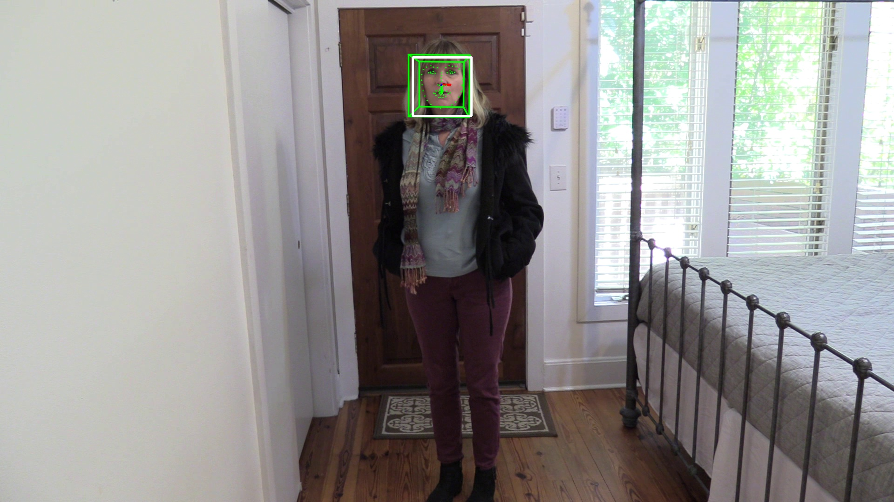

# Casual-MetaData
The demo of meta data which contains face bounding box, 68 facial landmarks and 3D head pose.



## Overview
We processed the [Casual Conversations Dataset](https://ai.facebook.com/datasets/casual-conversations-dataset/) to get meta data, which includes:

1. Face Bounding Box
2. 68 Facial Landmarks
3. 3D Head Pose Estimation

## Running
The Casual Conversations Dataset should be downloaded and go to the `src` directory run the command below.

```bash
python3 main.py --data_root /path/to/casual_dataset --save_root /path/to/save_path
```

## Access
We will release the download link of processed meta data soon.